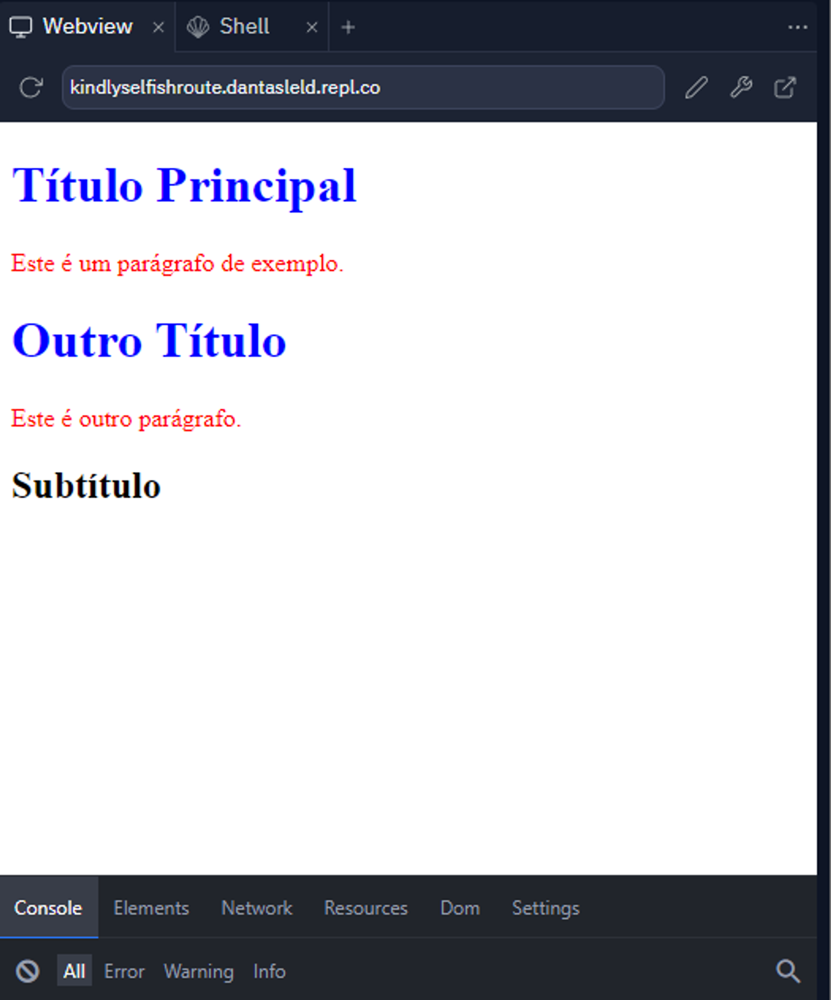
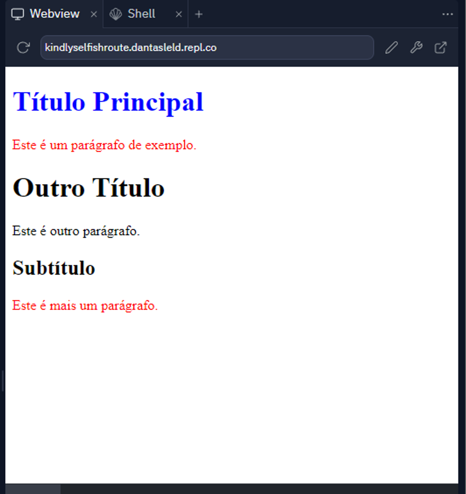
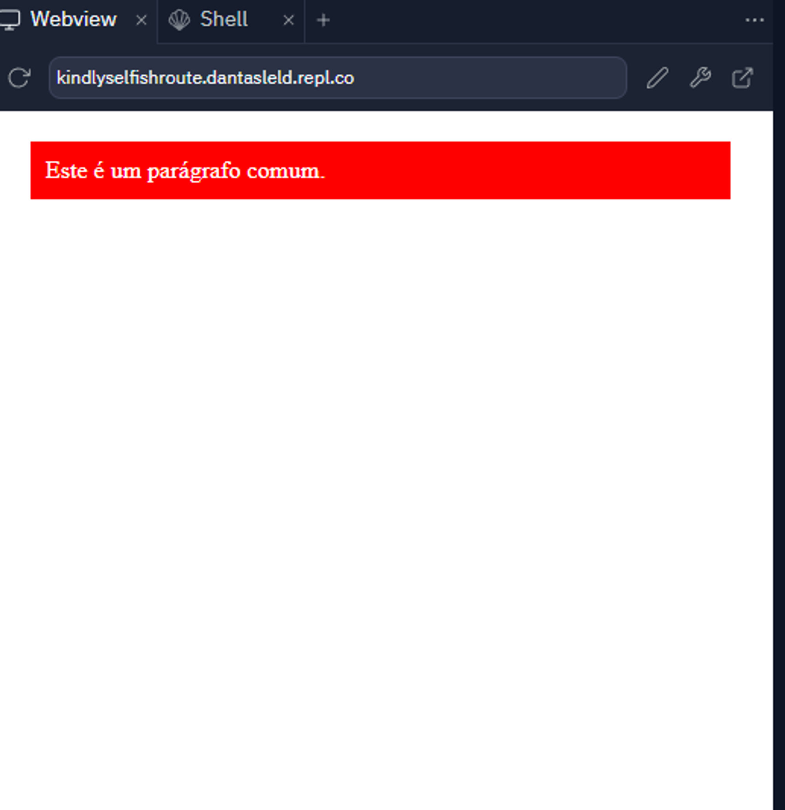
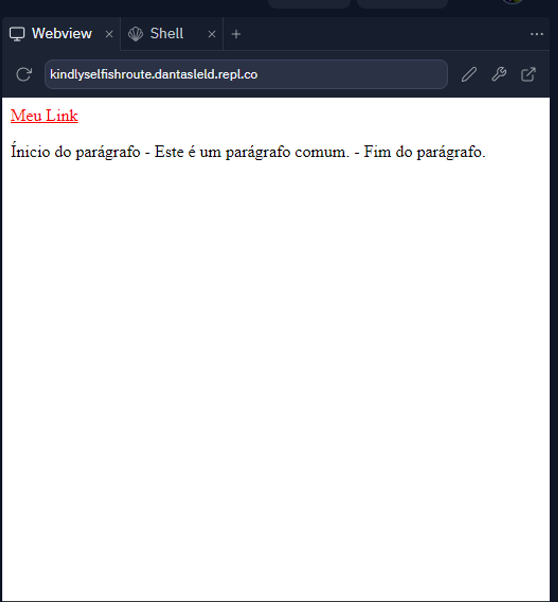
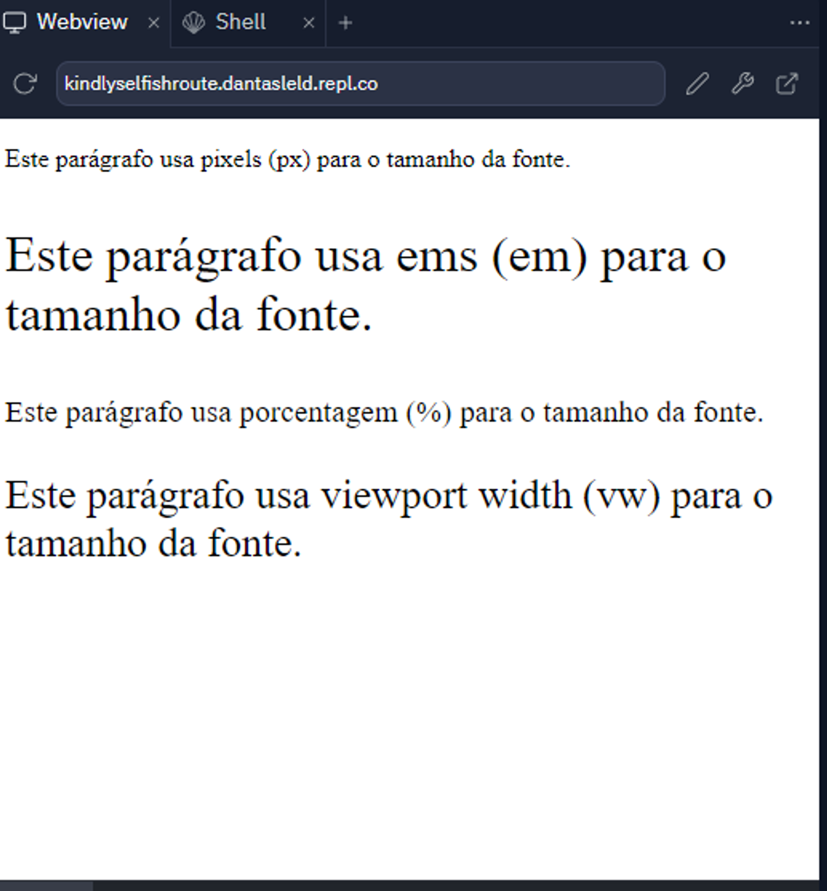

# Exércicios CSS (Básico)

### 1. Crie um arquivo `index.html`. Com o conteúdo abaixo:
    
  ```html
    <!DOCTYPE html>
    <html>
    <head>
      <style>
        /* seu codigo resposta aqui */
      </style>
    </head>
    <body>
      <h1>Título Principal</h1>
      <p>Este é um parágrafo de exemplo.</p>
      <h1>Outro Título</h1>
      <p>Este é outro parágrafo.</p>
      <h2>Subtítulo</h2>
    </body>
    </html>
  ```
    
  Agora, sua tarefa é aplicar a cor vermelha para todos os parágrafos (usando **`p`**) e a todos os cabeçalhos (usando **`h1`**) a cor azul.
  
  Lembre-se voce não pode mudar o HTML para colocar classes, voce precisa usar o seletor css de tipo. Exemplo final de resultado:
  
  
    
### 2. Crie um arquivo `index.html`. Com o conteúdo abaixo:
    
  ```html
    <!DOCTYPE html>
    <html>
    <head>
      <style>
          /* seu codigo resposta aqui */
      </style>
    </head>
    <body>
      <h1 id="meuTitulo">Título Principal</h1>
      <p class="paragrafo">Este é um parágrafo de exemplo.</p>
      <h1>Outro Título</h1>
      <p>Este é outro parágrafo.</p>
      <h2>Subtítulo</h2>
      <p class="paragrafo">Este é mais um parágrafo.</p>
    </body>
    </html>
  ```
    
  Agora, sua tarefa é aplicar a cor vermelha para todos os parágrafos que possuem a classe  `paragrafo` e a todos os cabeçalhos que possuem o id `meuTitulo` a cor azul.
  
  Lembre-se voce não pode mudar o HTML, voce precisa usar o seletor css de classe e id. Exemplo final de resultado:
  
  
    
### 3. Crie um arquivo `index.html`. Com o conteúdo abaixo:
    
  ```html
    <!DOCTYPE html>
    <html>
    <head>
      <style>
          /* seu codigo resposta aqui */
      </style>
    </head>
    <body>
      <p>Este é um parágrafo comum.</p>
    </body>
    </html>
  ```
    
  Agora, sua tarefa é estilizar o paragrafo para ficar do mesmo jeito que a imagem abaixo:
  
  Dicas:
  
  - Use `background-color` para aplicar a cor vermelha no fundo
  - Use `color` para aplicar a cor branca ao texto
  - Use `margin` para aplicar 20 pixels de margem
  - Use `paddding` para aplicar 10 pixels de espaçamento
  
  
    
### 4. Crie um arquivo `index.html`. Com o conteúdo abaixo:
    
  ```html
    <!DOCTYPE html>
    <html>
    
    <head>
      <style>
        a {
          color: green;
        }
    
        /* seu codigo resposta aqui */
      </style>
    </head>
    
    <body>
      <a href="https://www.example.com">Meu Link</a>
      <p>Este é um parágrafo comum.</p>
    </body>
    
    </html>
  ```
    
  Agora, sua tarefa é (Lembre-se voce não pode mudar o HTML):
  
  - Estilizar o link `<a>` quando o mouse passa sobre ele, deixando a cor dele vermelha, use a pseudo-classe `:hover` para isso.
  - Adicione conteúdo antes do parágrafo `<p>` usando o pseudo-elemento `::before` com o conteúdo “Ínicio do parágrafo - ”
  - Adicione conteúdo depois do parágrafo `<p>` usando o pseudo-elemento `::after` com o conteúdo “ - Fim do parágrafo.”
  
  Exemplo final de resultado:
  
  
    
### 5. Crie um arquivo `index.html`. Com o conteúdo abaixo:
    
  ```html
    <!DOCTYPE html>
    <html>
    <head>
      <style>
        p {
          color: red;
        }
    
        p.texto-azul {
          color: blue;
        }
    
        #paragrafo-especifico {
          color: green;
        }
      </style>
    </head>
    <body>
      <p>Este é um parágrafo comum.</p>
      <p class="texto-azul">Este parágrafo tem a classe "texto-azul".</p>
      <p id="paragrafo-especifico">Este parágrafo tem o ID "paragrafo-especifico".</p>
    </body>
    </html>
  ```
  
  Repare que todos são parágrafos `p` mas cada um está com uma cor diferente, mesmo eu colocando um estilo para aplicar a cor vermelha a todos os `p`.
  
  Explique com suas palavras o motivo disso (pesquise sobre precedência css para entender).
    
### 6. Crie um arquivo `index.html`. Com o conteúdo abaixo:
    
  ```html
    <!DOCTYPE html>
    <html>
    <head>
      <style>
        p {
          color: red;
        }
    
        section p {
          color: blue;
        }
      </style>
    </head>
    <body>
      <p>Este é um parágrafo comum.</p>
      <section>
        <p>Este é um parágrafo comum.</p>
      </section>
    </body>
    </html>
  ```
  
  Repare que todos o parágrafos `p` são estilizados para terem a cor vermelha, mas o parágrafo  dentro de `section` está com a cor azul.
  
  Explique com suas palavras o motivo disso (pesquise sobre especificidade css para entender).
    
### 7. Crie um arquivo `index.html`. Com o conteúdo abaixo:
    
  ```html
    <!DOCTYPE html>
    <html>
    <head>
      <style>
        /* seu codigo resposta aqui */
      </style>
    </head>
    <body>
      <p class="paragrafo-pixels">Este parágrafo usa pixels (px) para o tamanho da fonte.</p>
      <p class="paragrafo-ems">Este parágrafo usa ems (em) para o tamanho da fonte.</p>
      <p class="paragrafo-porcentagem">Este parágrafo usa porcentagem (%) para o tamanho da fonte.</p>
      <p class="paragrafo-viewport">Este parágrafo usa viewport width (vw) para o tamanho da fonte.</p>
    </body>
    </html>
  ```
  
  Agora, sua tarefa é (Lembre-se voce não pode mudar o HTML):
  
  - Altere a `font-size` do parágrafo com a classe `paragrafo-pixels` para definir o tamanho da fonte em 20 pixels.
  - Altere a `font-size` do parágrafo com a classe `paragrafo-ems` para definir o tamanho da fonte em 2 em.
  - Altere a `font-size` do parágrafo com a classe `paragrafo-porcentagem` para definir o tamanho da fonte em 120 por cento.
  - Altere a `font-size` do parágrafo com a classe `paragrafo-viewport` para definir o tamanho da fonte em 5 view port.
  
  Exemplo final de resultado:
  
  