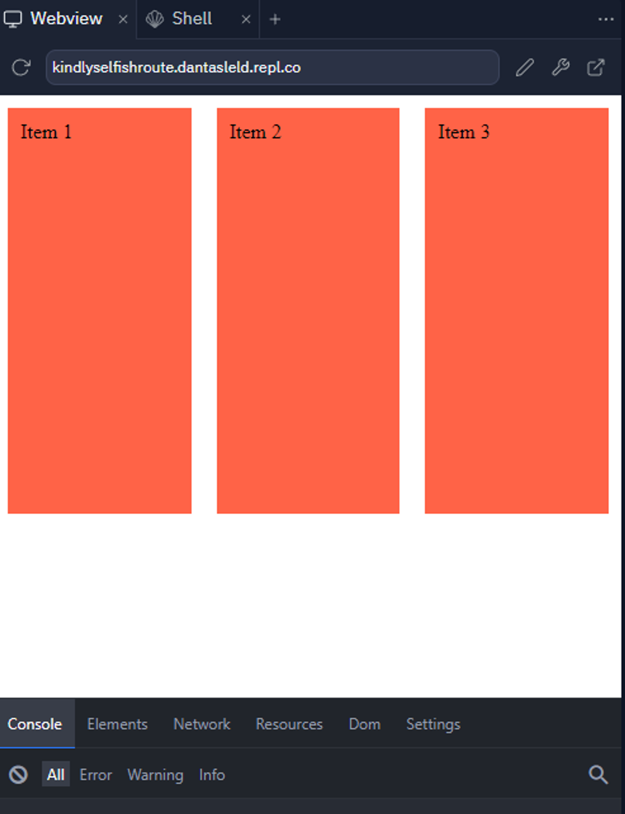
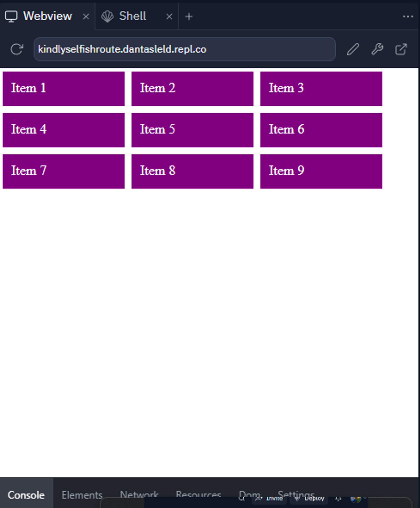
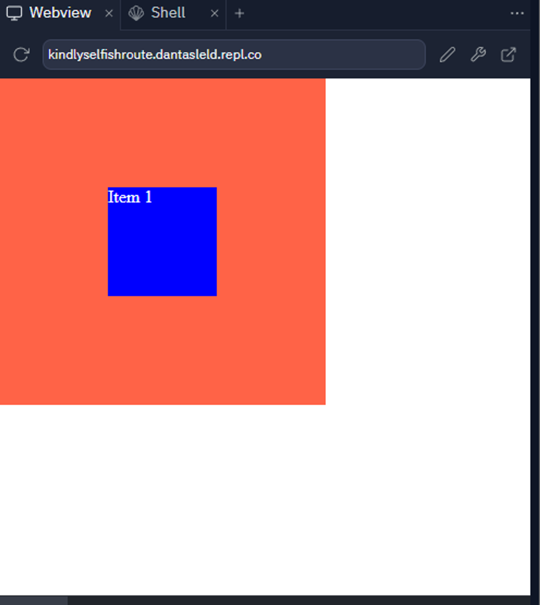

# Exércicios CSS (Layout e Responsividade)

1. Crie um arquivo `index.html`. Com o conteúdo abaixo:
    
  ```html
    <!DOCTYPE html>
    <html>
    
    <head>
      <style>
        body {
          margin: 0;
          padding: 0;
          border: 0;
        }
    
        .item {
          width: 300px;
          height: 300px;
          background-color: tomato;
          margin: 10px;
          padding: 10px;
        }
        
        /* seu codigo resposta aqui */
      </style>
    </head>
    
    <body>
      <div class="container">
        <div class="item">Item 1</div>
        <div class="item">Item 2</div>
        <div class="item">Item 3</div>
      </div>
    </body>
    
    </html>
  ```
    
  Agora, sua tarefa é aplicar o display `flex` ao container para deixa-los alinhados lado a lado, Exemplo final de resultado:
  
  
    
2. Crie um arquivo `index.html`. Com o conteúdo abaixo:
    
  ```html
    <!DOCTYPE html>
    <html>
    
    <head>
      <style>
        body {
          margin: 0;
          padding: 0;
          border: 0;
        }
    
        .item {
          color: white;
          height: 20px;
          width: 100%;
          background-color: purple;
          padding: 10px;
          margin: 4px;
          
          /* seu codigo resposta aqui */
        }
    
        .container {
          /* seu codigo resposta aqui */
        }
        
      </style>
    </head>
    
    <body>
      <div class="container">
        <div class="item">Item 1</div>
        <div class="item">Item 2</div>
        <div class="item">Item 3</div>
        <div class="item">Item 4</div>
        <div class="item">Item 5</div>
        <div class="item">Item 6</div>
        <div class="item">Item 7</div>
        <div class="item">Item 8</div>
        <div class="item">Item 9</div>
      </div>
    </body>
    
    </html>
  ```
  
  Agora, sua tarefa é aplicar o display `flex` ao container e deixar os itens sendo exibidos de 3 em 3, utilizando o `flex-wrap` e limitando a `max-width` do item. Exemplo final de resultado:
  
  
    
### 3. Crie um arquivo `index.html`. Com o conteúdo abaixo:
    
  ```html
    <!DOCTYPE html>
    <html>
    
    <head>
      <style>
        body {
          margin: 0;
          padding: 0;
          border: 0;
        }
    
        .item {
          color: white;
          background-color: blue;
          height: 100px;
          width: 100px;
        }
    
        .container {
          background-color: tomato;
          height: 300px;
          width: 300px;
    
          /* seu codigo resposta aqui */
        }
        
      </style>
    </head>
    
    <body>
      <div class="container">
        <div class="item">Item 1</div>
      </div>
    </body>
    
    </html>
  ```
  
  Agora, sua tarefa é aplicar o display `flex` ao container e centralizar o item no meio do container, utilizando as propriedades `align-items` e `justify-content`.  Exemplo final de resultado:
  
  