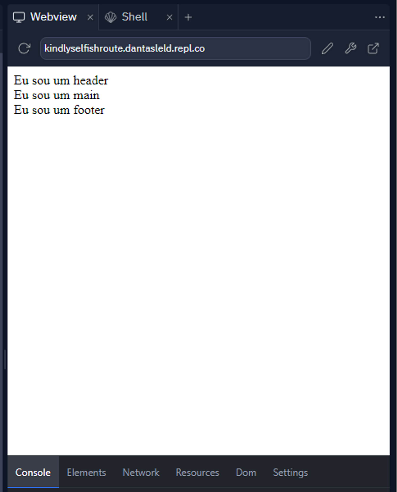
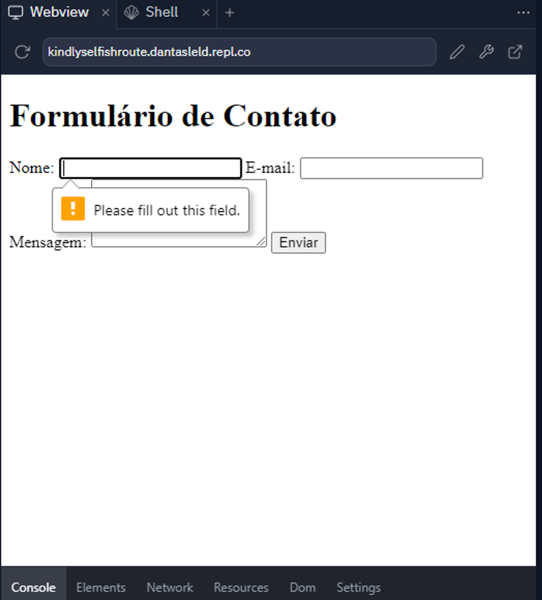

# Exércicios HTML (Estrutura, Semântica e Formulários)

###  1. Crie um arquivo HTML com sua estrutura basica, contendo:

  - Doctype
  - E as tags html, head, title, body, header, main, footer
  
  Exemplo final de resultado:
  
  

    
### 2. Crie um arquivo `index.html`. Com o conteúdo abaixo:
    
  ```html
    <!DOCTYPE html>
    <html>
    <head>
      <title>Exercício de Semântica HTML</title>
    </head>
    <body>
      <div id="header">
        <div id="logo">Meu Site</div>
        <div id="menu">
          <ul>
            <li><a href="#">Página Inicial</a></li>
            <li><a href="#">Sobre</a></li>
            <li><a href="#">Contato</a></li>
          </ul>
        </div>
      </div>
      <div id="content">
        <div id="about">
          <h1>Sobre Nós</h1>
          <p>Lorem ipsum dolor sit amet, consectetur adipiscing elit.</p>
        </div>
        <div id="contact">
          <h1>Contato</h1>
          <p>Você pode nos contatar pelo e-mail: exemplo@meusite.com</p>
        </div>
      </div>
      <div id="footer">&copy; 2023 Meu Site</div>
    </body>
    </html>
  ```
    
    Agora, sua tarefa é melhorar a semântica deste código HTML, substituindo os elementos não semânticos por elementos HTML mais apropriados para criar uma estrutura HTML mais descritiva e semântica.
    
### 3. Crie um arquivo `index.html`. Com o conteúdo abaixo:
    
  ```html
    <!DOCTYPE html>
    <html>
    <head>
      <title>Exercício de Formulários HTML</title>
    </head>
    <body>
      <h1>Formulário de Contato</h1>
      <!-- seu formulário aqui -->
    </body>
    </html>
  ```
    
  Agora, sua tarefa é criar um formulário HTML simples.
  
  O formulário contém campos para Nome, E-mail e Mensagem, todos com atributos **`id`**, **`name`**.
  
  Lembre-se de colocar todos os campos como obrigatorios usando `required`. Exemplo final de resultado:
  
  